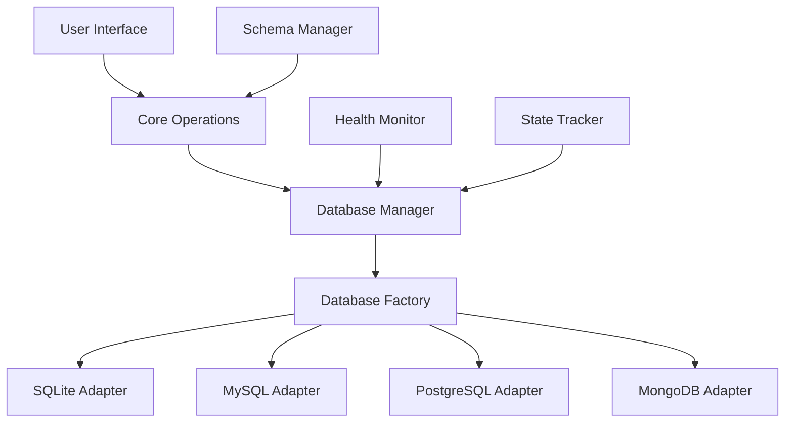

<div align="center">

# 📒 Multi-Database Contact Manager Pro

*A professional contact management system with multi-database support and dynamic schema management*

[](https://python.org)
[](https://docker.com)
[](LICENSE)
[](CONTRIBUTING.md)

[Features](#-features) • [Quick Start](#-quick-start) • [Documentation](DOCS.md) • [Docker](#-docker-deployment) • [Contributing](#-contributing)

</div>

---

## 🌟 Overview

**Multi-Database Contact Manager Pro** is an enterprise-grade contact management system that seamlessly works with **SQLite**, **MySQL**, **PostgreSQL**, and **MongoDB**. Built with Python, it features dynamic schema management, real-time database switching, and professional-grade data operations.

### 🎯 What Makes It Special

- **🔄 Database Agnostic** - Same codebase works with 4 different database types
- **🏗️ Dynamic Schema** - Add custom fields at runtime without code changes
- **🚀 Zero Configuration** - Automatic database detection and health monitoring
- **🐳 Docker Ready** - Full containerization support with one-command deployment
- **📊 Enterprise Features** - Analytics, bulk operations, backup/restore, data validation

---

## ✨ Features

<table>
<tr>
<td width="50%">

### 🗄️ **Multi-Database Support**
- **SQLite** - File-based, zero setup
- **MySQL** - Industry standard RDBMS
- **PostgreSQL** - Advanced SQL features
- **MongoDB** - NoSQL document store
- **Automatic failover** between databases

### 🏗️ **Dynamic Schema Management**
- Runtime column addition/removal
- Cross-database schema compatibility
- Automatic schema introspection
- Type-safe field operations

</td>
<td width="50%">

### 📊 **Professional Operations**
- **CRUD Operations** with validation
- **Advanced Search** & filtering
- **Bulk Operations** for efficiency
- **Import/Export** (CSV, JSON)
- **Real-time Analytics** & reporting
- **Automated Backups** with restore

### 🛡️ **Enterprise Security**
- Input validation & sanitization
- SQL injection prevention
- Data integrity monitoring
- Multi-level confirmations

</td>
</tr>
</table>

---

## 🚀 Quick Start

### Option 1: Full Docker (Recommended)
```bash
# Clone and setup
git clone https://github.com/yourusername/multi-db-contact-manager-pro.git
cd multi-db-contact-manager-pro
cp docker.env.example docker.env

# Start everything in Docker
docker compose --profile full up --build

# Connect to the app (in another terminal)
docker compose exec contact-manager python main.py
```

### Option 2: Local Development
```bash
# Setup Python environment
python -m venv .venv
source .venv/bin/activate  # On Windows: .venv\Scripts\activate
pip install -r requirements.txt

# Setup configuration
cp docker.env.example docker.env

# Start databases in Docker
docker compose up -d mysql postgres mongodb

# Run the application
python main.py
```

### Option 3: Quick Scripts
```bash
# Full Docker deployment
./start-docker-app.sh

# Or databases only (run app locally)
./start-databases-only.sh && python main.py
```

---

## 🎮 Interactive Demo

```
📒 Contact Book Manager
==================================================
🗄️  Current Database: POSTGRESQL
==================================================
1. ➕ Add Contact
2. 👀 View All Contacts
3. 🔍 Search Contacts
4. ✏️  Update Contact
5. 🗑️  Delete Contact
6. 📊 Advanced Features
7. ⚙️  Database Management
8. 🗄️  Switch Database
0. 🔙 Back to Previous Menu
111. 🚪 Exit Application
==================================================
```

### 🔄 Database Switching
Switch between databases seamlessly:
```
🗄️  Database Selection
==================================================
Current: POSTGRESQL
==================================================
1. 💾 SQLite - Local file database ✅ HEALTHY
2. 🐬 MySQL - Popular relational database ✅ HEALTHY
3. 🐘 PostgreSQL - Advanced relational database ✅ ACTIVE
4. 🍃 MongoDB - Document-based NoSQL ✅ HEALTHY
```

---

## 🏗️ Architecture

<div align="center">



</div>

### 🧩 Key Components

| Component | Purpose | Features |
|-----------|---------|----------|
| **Database Adapters** | Unified database interface | CRUD, search, bulk ops, schema management |
| **Health Monitor** | Database availability tracking | Auto-detection, failover, status persistence |
| **Schema Manager** | Dynamic schema operations | Add/remove columns, type validation, introspection |
| **State Tracker** | Application state persistence | Last used DB, health status, user preferences |

---

## 🐳 Docker Deployment

### 🎯 Deployment Options

| Option | Use Case | Command |
|--------|----------|---------|
| **Full Docker** | Production, isolated environment | `docker compose --profile full up --build` |
| **Hybrid** | Development, debugging | `docker compose up -d mysql postgres mongodb` |
| **Scripts** | Quick setup | `./start-docker-app.sh` |

### 📦 Docker Services

```yaml
Services:
  📱 contact-manager    # Python application
  🐬 mysql             # MySQL 8.0 (port 3306)
  🐘 postgres          # PostgreSQL 15 (port 5433)
  🍃 mongodb           # MongoDB 7.0 (port 27017)
  🔧 adminer           # Database admin UI (port 8050)
```

---

## 📊 Feature Showcase

### 🔍 Advanced Search
```bash
🔍 Advanced Search
------------------------------
Search by name: John
Search by phone: 555
Search by email: @company.com
Minimum ID: 1
Maximum ID: 100

🎯 Found 15 contact(s) matching criteria
```

### 📈 Analytics Dashboard
```bash
📊 Contact Analytics
------------------------------
📞 Total Contacts: 1,247
📱 With Phone: 1,198 (96.1%)
📧 With Email: 1,156 (92.7%)
✅ Complete: 1,089 (87.3%)

🌐 Top Email Domains:
   gmail.com: 312 contacts
   company.com: 156 contacts
   outlook.com: 89 contacts
```

### 🔄 Bulk Operations
```bash
🔄 Bulk Operations
------------------------------
Operation: Update Department
Contact IDs: 1,5,12,18,25
New Value: Engineering
✅ Updated 5 contacts successfully!
```

---

## 🛠️ Development

### 📋 Prerequisites
- **Python 3.8+**
- **Docker & Docker Compose**
- **Git**

### 🔧 Development Setup
```bash
# Clone repository
git clone https://github.com/yourusername/multi-db-contact-manager-pro.git
cd multi-db-contact-manager-pro

# Setup Python environment
python -m venv .venv
source .venv/bin/activate
pip install -r requirements.txt

# Setup pre-commit hooks (optional)
pip install pre-commit
pre-commit install

# Run tests
python test_all_databases.py
```

### 🧪 Testing
```bash
# Test all databases
python test_all_databases.py

# Test specific database
MYSQL_HOST=localhost python test_all_databases.py

# Run with verbose output
DEBUG=1 python test_all_databases.py
```

---

## 📚 Documentation

| Document | Description |
|----------|-------------|
| **[DOCS.md](DOCS.md)** | Complete documentation with architecture, deployment, and troubleshooting |
| **[docker.env.example](docker.env.example)** | Environment configuration template |
| **[DOCKER_COMMANDS.txt](DOCKER_COMMANDS.txt)** | Docker command reference |

---

## 🤝 Contributing

We welcome contributions! Here's how to get started:

1. **Fork** the repository
2. **Create** a feature branch (`git checkout -b feature/amazing-feature`)
3. **Commit** your changes (`git commit -m 'Add amazing feature'`)
4. **Push** to the branch (`git push origin feature/amazing-feature`)
5. **Open** a Pull Request

### 🐛 Bug Reports
Found a bug? Please open an issue with:
- Steps to reproduce
- Expected vs actual behavior
- Environment details (OS, Python version, database)

---

## 📈 Roadmap

- [ ] **Web Interface** - React-based web UI
- [ ] **REST API** - RESTful API endpoints
- [ ] **Authentication** - User management and permissions
- [ ] **Cloud Databases** - AWS RDS, Azure SQL, Google Cloud SQL
- [ ] **Import Formats** - Excel, vCard, LDAP
- [ ] **Reporting** - Advanced analytics and charts

---

## 📄 License

This project is licensed under the MIT License - see the [LICENSE](LICENSE) file for details.

---

## 🙏 Acknowledgments

- **SQLAlchemy** - Database toolkit for Python
- **PyMongo** - MongoDB driver for Python
- **Docker** - Containerization platform
- **Python Community** - For amazing libraries and tools

---

<div align="center">

**⭐ Star this repo if you find it useful!**

[Report Bug](https://github.com/yourusername/multi-db-contact-manager-pro/issues) • [Request Feature](https://github.com/yourusername/multi-db-contact-manager-pro/issues) • [Documentation](DOCS.md)

Made with ❤️ by developers, for developers

</div>
