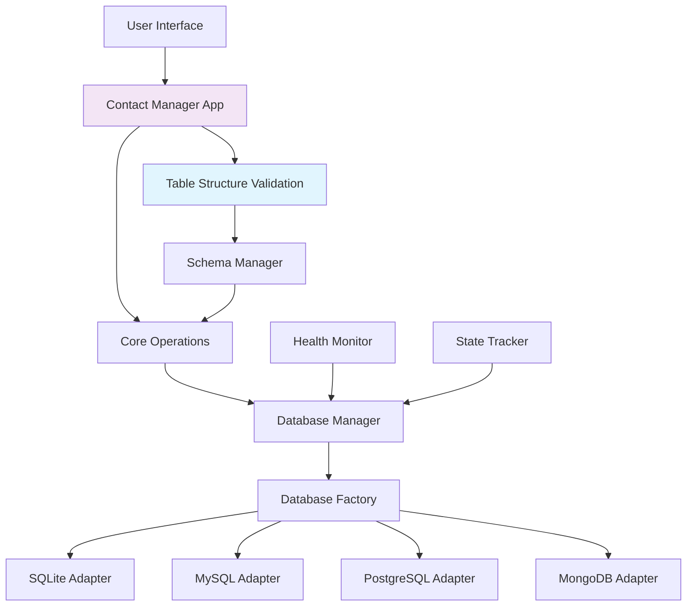
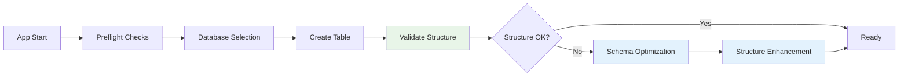

<div align="center">

# 📒 Multi-Database Contact Manager Pro

*A professional contact management system with multi-database support, dynamic schema management, and enterprise-grade features*

[](https://python.org)
[](https://docker.com)
[](#-database-support)
[](LICENSE)
[](CONTRIBUTING.md)

[Features](#-features) • [Quick Start](#-quick-start) • [App Flow](#-application-flow) • [Docker](#-docker-deployment) • [Documentation](docs/DOCS.md)

</div>

---

## 🌟 Overview

**Multi-Database Contact Manager Pro** is an enterprise-grade contact management system that seamlessly works with **SQLite**, **MySQL**, **PostgreSQL**, and **MongoDB**. Built with Python, it features automatic table structure validation, real-time database switching, and professional-grade data operations with comprehensive error handling.

### 🎯 What Makes It Special

- **🔄 Database Agnostic** - Same codebase works with 4 different database types
- **🛡️ Smart Validation** - Intelligent table structure validation and optimization
- **🏗️ Dynamic Schema** - Add custom fields at runtime without code changes
- **🚀 Zero Configuration** - Automatic database detection and health monitoring
- **🐳 Docker Ready** - Full containerization support with one-command deployment
- **📊 Enterprise Features** - Analytics, bulk operations, backup/restore, data validation
- **⚡ Intelligent Operations** - Smart error detection and automatic optimization

---

## ✨ Features

<table>
<tr>
<td width="50%">

### 🗄️ **Multi-Database Support**
- **SQLite** - File-based, zero setup
- **MySQL** - Industry standard RDBMS with automatic timestamps
- **PostgreSQL** - Advanced SQL features with triggers
- **MongoDB** - NoSQL document store with native datetime
- **Automatic failover** between databases
- **Consistent schema** across all database types

### 🏗️ **Dynamic Schema Management**
- Runtime column addition/removal
- Cross-database schema compatibility
- Automatic schema introspection
- Type-safe field operations
- **Enterprise-grade validation system**

</td>
<td width="50%">

### 📊 **Professional Operations**
- **CRUD Operations** with validation
- **Advanced Search** & filtering
- **Enhanced Bulk Operations** - 6 deletion methods, smart updates
- **Import/Export** (CSV, JSON)
- **Real-time Analytics** & reporting
- **Automated Backups** with restore
- **Dummy Data Generation** for testing

### 🛡️ **Enterprise Security & Reliability**
- Input validation & sanitization
- SQL injection prevention
- Data integrity monitoring
- Multi-level confirmations
- **Intelligent error recovery system**
- **Advanced structure validation**

</td>
</tr>
</table>

---

## 🗄️ Database Support

| Database | Status | Features | Timestamps | Indexes |
|----------|--------|----------|------------|---------|
| **SQLite** | ✅ Production Ready | File-based, ACID compliant | Manual UTC handling | B-tree indexes |
| **MySQL** | ✅ Production Ready | ACID, transactions, foreign keys | Automatic with triggers | Multiple index types |
| **PostgreSQL** | ✅ Production Ready | Advanced SQL, JSON support | UTC with triggers | GIN, GiST, B-tree |
| **MongoDB** | ✅ Production Ready | Document store, flexible schema | Native datetime objects | Compound indexes |

### 🔧 Advanced Database Features
- **Unified 6-column schema** across all database types (id, name, phone, email, created_at, updated_at)
- **Automatic timestamp management** with UTC storage and configurable timezone display
- **Optimized indexing strategy** for maximum query performance
- **Intelligent schema validation** with automatic consistency checks
- **Dynamic column management** with runtime schema expansion
- **Cross-database compatibility** with unified operations

---

## 🚀 Quick Start

### Option 1: Full Docker (Recommended)
```bash
# Clone and setup
git clone https://github.com/yourusername/multi-db-contact-manager-pro.git
cd multi-db-contact-manager-pro
cp docker.env.example docker.env

# Start everything in Docker
docker compose --profile full up --build

# Connect to the app (in another terminal)
docker compose exec contact-manager python main.py
```

### Option 2: Local Development
```bash
# Setup Python environment
python -m venv .venv
source .venv/bin/activate  # On Windows: .venv\Scripts\activate
pip install -r requirements.txt

# Setup configuration
cp docker.env.example docker.env

# Start databases in Docker
docker compose up -d mysql postgres mongodb

# Run the application
python main.py
```

### Option 3: Quick Scripts
```bash
# Full Docker deployment
./start-docker-app.sh

# Stop all services
./stop-docker-app.sh

# Or databases only (run app locally)
./start-databases-only.sh && python main.py
```

### Option 4: Development Scripts (NEW) ⚡
```bash
# Quick rebuild & run (fastest for development)
./run-app.sh

# Interactive rebuild menu with options
./quick-rebuild.sh

# Available from scripts/ directory too
scripts/run-app.sh
scripts/quick-rebuild.sh
```

---

## 🎮 Application Flow

### 🏠 Main Menu Experience
```
📒 Contact Book Manager
==================================================
🗄️  Current Database: MYSQL (✅ HEALTHY)
📊 Database Info: 1,247 contacts | 15.2 MB | localhost:3306
==================================================
1. ➕ Add Contact
2. 👀 View All Contacts (1,247 contacts)
3. 🔍 Search Contacts
4. ✏️  Update Contact
5. 🗑️  Delete Contact
6. 📊 Advanced Features
7. ⚙️  Database Management
8. 🗄️  Switch Database
0. 🔙 Back to Previous Menu
111. 🚪 Exit Application
==================================================
Enter your choice (0-111): 
```

### ➕ Adding Contacts
```
➕ Add New Contact
==================================================
📝 Enter contact information:

👤 Name: John Smith
📞 Phone: +1-555-123-4567
📧 Email: john.smith@company.com

✅ Contact added successfully!
📊 Contact ID: 1248
🕒 Created: 2024-01-15 14:30:25 UTC
```

### 🔍 Advanced Search
```
🔍 Advanced Search
==================================================
🎯 Search Filters:
   Name contains: John
   Phone contains: 555
   Email domain: @company.com
   ID range: 1-1000

🔍 Searching across 1,247 contacts...
✅ Found 15 contact(s) matching criteria

📋 Results:
1. John Smith | +1-555-123-4567 | john.smith@company.com
2. John Doe | +1-555-987-6543 | john.doe@company.com
...
```

### 📊 Analytics Dashboard
```
📊 Contact Analytics
==================================================
📈 Database Statistics:
   📞 Total Contacts: 1,247
   📱 With Phone: 1,198 (96.1%)
   📧 With Email: 1,156 (92.7%)
   ✅ Complete Profiles: 1,089 (87.3%)
   💾 Database Size: 15.2 MB

🌐 Top Email Domains:
   1. gmail.com: 312 contacts (27.0%)
   2. company.com: 156 contacts (13.5%)
   3. outlook.com: 89 contacts (7.7%)
   4. yahoo.com: 67 contacts (5.8%)
   5. hotmail.com: 45 contacts (3.9%)

📅 Recent Activity:
   Today: 23 new contacts
   This week: 156 new contacts
   This month: 489 new contacts
```

### 🗄️ Database Switching
```
🗄️  Database Selection
==================================================
Current: MYSQL (✅ ACTIVE)
==================================================
Available Databases:

1. 💾 SQLite
   📍 Location: data/contacts.db
   📊 Status: ✅ HEALTHY (1,247 contacts)
   💾 Size: 2.1 MB

2. 🐬 MySQL  
   📍 Host: localhost:3306
   📊 Status: ✅ ACTIVE (1,247 contacts)
   💾 Size: 15.2 MB

3. 🐘 PostgreSQL
   📍 Host: localhost:5433
   📊 Status: ✅ HEALTHY (1,247 contacts)
   💾 Size: 18.7 MB

4. 🍃 MongoDB
   📍 Host: localhost:27017
   📊 Status: ✅ HEALTHY (1,247 documents)
   💾 Size: 12.8 MB

==================================================
Enter your choice (1-4): 3

🔄 Switching to PostgreSQL...
✅ Successfully switched to PostgreSQL!
🔧 Optimizing database structure...
✅ Database structure optimized (6 columns)
```

### 🎲 Dummy Data Generation
```
🎲 Insert Dummy Data
==================================================
🗄️  Current Database: MYSQL
📊 Current Status: 1,247 contacts in database

Dummy Data Options:
1. ⚡ Quick Insert (10 contacts)
2. 🎯 Custom Insert (choose amount)
3. 👁️  Preview Sample Data
4. 🔄 Generate with Specific Criteria
0. 🔙 Back to Previous Menu

Enter your choice (0-4): 2

🎯 Custom Insert
----------------------------------------
Enter number of contacts to generate (1-1000): 77

🎲 Generating 77 dummy contacts...
🔍 Checking existing contacts for uniqueness...
📊 Found 1,247 existing emails and 1,198 existing phones
📊 Generating 77 unique contacts...
📝 Inserting contacts into database...
✅ ✅ Successfully inserted 77 contacts!

📈 Generation Statistics:
   Requested: 77
   Generated: 77
   Inserted: 77
   Database: MYSQL
   Uniqueness Check: ✅ Enabled
   Time Taken: 2.3 seconds
```

### ⚙️ Database Management
```
⚙️  Database Management
==================================================
🗄️  Current Database: MYSQL
📊 Health Status: ✅ HEALTHY
==================================================
1. 📊 View Database Statistics
2. 🔧 Database Health Check
3. 💾 Backup Database
4. 📥 Restore from Backup
5. 🧹 Clean Database
6. 🔄 Reset Table Structure
7. 🗂️  Manage Columns
8. 🔍 Data Integrity Check
0. 🔙 Back to Main Menu

Enter your choice (0-8): 1

📊 Database Statistics
==================================================
🗄️  Database Type: MYSQL
🌐 Host: localhost:3306
📦 Database Name: contacts
👤 User: contact_user
📊 Connection Status: ✅ CONNECTED

📈 Table Information:
   📋 Table Name: contacts
   📊 Total Records: 1,324
   📏 Columns: 6 (id, name, phone, email, created_at, updated_at)
   🕒 Timestamps: UTC storage with timezone-aware display
   💾 Table Size: 15.2 MB
   📅 Last Modified: 2024-01-15 14:45:12 UTC

🔍 Data Quality:
   ✅ All records have names
   📞 96.1% have phone numbers
   📧 92.7% have email addresses
   🕒 All timestamps are valid
```

---

## 🏗️ Architecture

<div align="center">



</div>

### 🧩 Key Components

| Component | Purpose | Key Features |
|-----------|---------|--------------|
| **Database Adapters** | Unified database interface | Cross-database compatibility, automatic timestamp handling |
| **Health Monitor** | Database availability tracking | Real-time status monitoring, intelligent failover |
| **Schema Manager** | Dynamic schema operations | Runtime column management, type validation |
| **State Tracker** | Application state persistence | Session management, preference storage |
| **Table Validation** | Structure consistency | Automatic validation, intelligent schema repair |

### 🔄 Application Startup Flow


---

## 🐳 Docker Deployment

### 🎯 Deployment Options

| Option | Use Case | Start Command | Stop Command | Services |
|--------|----------|---------------|--------------|----------|
| **Full Docker** | Production, isolated environment | `docker compose --profile full up --build` | `docker compose --profile full down` | App + All DBs |
| **Hybrid** | Development, debugging | `docker compose up -d mysql postgres mongodb` | `docker compose down` | DBs only |
| **Scripts** | Quick setup | `./start-docker-app.sh` | `./stop-docker-app.sh` | Automated |
| **Dev Scripts** ⚡ | Fast development | `./run-app.sh` | `Ctrl+C` | Quick rebuild |

### 📦 Docker Services

```yaml
Services:
  📱 contact-manager    # Python application (profile: full)
  🐬 mysql             # MySQL 8.0 (port 3306)
  🐘 postgres          # PostgreSQL 15 (port 5433)  
  🍃 mongodb           # MongoDB 7.0 (port 27017)
  🔧 adminer           # Database admin UI (port 8050)

Volumes:
  📁 mysql_data        # Persistent MySQL data
  📁 postgres_data     # Persistent PostgreSQL data
  📁 mongo_data        # Persistent MongoDB data
  📁 ./data            # SQLite files and backups
```

### 🔧 Docker Configuration

**Environment Variables** (docker.env):
```bash
# Database Selection
DB_TYPE=mysql  # sqlite, mysql, postgres, mongodb

# MySQL Configuration
MYSQL_HOST=localhost
MYSQL_PORT=3306
MYSQL_USER=contact_user
MYSQL_PASSWORD=contact_password
MYSQL_DATABASE=contacts

# PostgreSQL Configuration  
POSTGRES_HOST=localhost
POSTGRES_PORT=5433
POSTGRES_USER=contact_user
POSTGRES_PASSWORD=contact_password
POSTGRES_DATABASE=contacts

# MongoDB Configuration
MONGO_HOST=localhost
MONGO_PORT=27017
MONGO_DATABASE=contacts

# Application Settings
DEBUG=0
CONTACT_MANAGER_DISABLE_UI=0
```

---

## 🛠️ Development

### 📋 Prerequisites
- **Python 3.8+**
- **Docker & Docker Compose**
- **Git**

### 🔧 Development Setup
```bash
# Clone repository
git clone https://github.com/yourusername/multi-db-contact-manager-pro.git
cd multi-db-contact-manager-pro

# Setup Python environment
python -m venv .venv
source .venv/bin/activate  # Windows: .venv\Scripts\activate
pip install -r requirements.txt

# Setup configuration
cp docker.env.example docker.env

# Start databases
docker compose up -d mysql postgres mongodb

# Run application
python main.py
```

### 🧪 Testing

```bash
# Test all databases
python src/contact_manager/tests/test_all_databases.py

# Test specific database
MYSQL_HOST=localhost python src/contact_manager/tests/test_all_databases.py

# Run with verbose output
DEBUG=1 python src/contact_manager/tests/test_all_databases.py

# Test preflight checks
python src/contact_manager/tests/test_preflight.py
```

### 🔍 Debugging

```bash
# Enable debug mode
export DEBUG=1
python main.py

# Check database health
python -c "
from src.contact_manager.database.manager import db_manager
print(f'Current DB: {db_manager.current_db_type}')
print(f'Health: {db_manager.test_current_connection()}')
"

# Validate table structure
python -c "
from src.contact_manager.core.schema_manager import SchemaManager
print('Columns:', SchemaManager.get_table_columns())
"
```

---

## 📚 Documentation

| Document | Description |
|----------|-------------|
| **[DOCS.md](docs/DOCS.md)** | Complete documentation with architecture and troubleshooting |
| **[PROJECT_STRUCTURE.md](docs/PROJECT_STRUCTURE.md)** | Detailed project structure and component overview |
| **[DOCKER_SETUP_GUIDE.md](docs/DOCKER_SETUP_GUIDE.md)** | Comprehensive Docker deployment guide |
| **[docker.env.example](docker.env.example)** | Environment configuration template |

---

## 🚨 Troubleshooting

### Common Issues and Solutions

#### 🔧 Database Structure Optimization
**Feature:** Intelligent schema validation ensures optimal database structure.
```bash
# The app automatically:
# 1. Validates table structure on startup
# 2. Ensures consistent 6-column schema across all databases
# 3. Optimizes timestamp handling for each database type
# 4. Provides real-time validation feedback
```

#### ❌ Database Connection Failed
```bash
# Check database status
docker compose ps

# Restart specific database
docker compose restart mysql

# Check logs
docker compose logs mysql
```

#### ❌ Import/Export Errors
```bash
# Ensure proper file permissions
chmod 644 your_file.csv

# Check file encoding (should be UTF-8)
file -I your_file.csv
```

#### ❌ Docker Issues
```bash
# Clean restart using scripts
./stop-docker-app.sh
./start-docker-app.sh

# Or manual commands
docker compose --profile full down
docker compose --profile full up --build

# Reset volumes (⚠️ deletes data)
docker compose --profile full down -v
docker volume prune
```

---

## 🎯 Enterprise Features & Capabilities

### 🛡️ Advanced Data Management
- **🔍 Intelligent Schema Validation** - Automatic structure validation and optimization on every startup
- **🔧 Cross-Database Consistency** - Unified 6-column structure across all database types
- **⚡ Optimized MySQL Performance** - Advanced timestamp handling and auto-increment optimization
- **🐘 PostgreSQL Enterprise Features** - Trigger functions for automatic timestamp management
- **🍃 MongoDB Performance Tuning** - Comprehensive indexing strategy for optimal query performance
- **📊 Advanced Error Intelligence** - Detailed diagnostics and intelligent recovery suggestions
- **🔄 Comprehensive Health Monitoring** - Real-time database health validation and reporting

### 🚀 Technical Excellence
- **Unified Schema Architecture** across all database types
- **Dynamic Column Management** with intelligent type detection
- **Resilient Error Handling** with graceful fallbacks and recovery
- **Enterprise Docker Integration** with production-ready initialization
- **Performance Optimization** designed for large-scale datasets

---

## 🤝 Contributing

We welcome contributions! Here's how to get started:

### 🚀 Quick Contribution Guide
1. **Fork** the repository
2. **Create** a feature branch (`git checkout -b feature/amazing-feature`)
3. **Make your changes** and test thoroughly
4. **Run tests** (`python src/contact_manager/tests/test_all_databases.py`)
5. **Commit** your changes (`git commit -m 'Add amazing feature'`)
6. **Push** to the branch (`git push origin feature/amazing-feature`)
7. **Open** a Pull Request

### 🐛 Bug Reports
Found a bug? Please open an issue with:
- **Steps to reproduce** the issue
- **Expected vs actual behavior**
- **Environment details** (OS, Python version, database type)
- **Error messages** and logs
- **Screenshots** if applicable

### 💡 Feature Requests
Have an idea? We'd love to hear it! Please include:
- **Clear description** of the feature
- **Use case** and benefits
- **Possible implementation** approach

---

## 📈 Roadmap

### 🎯 Short Term (Next 3 months)
- [ ] **Web Interface** - React-based web UI with real-time updates
- [ ] **REST API** - RESTful API endpoints with OpenAPI documentation
- [ ] **Enhanced Search** - Full-text search with ranking and filters
- [ ] **Data Validation Rules** - Custom validation rules per field

### 🚀 Medium Term (3-6 months)
- [ ] **Authentication System** - User management and role-based permissions
- [ ] **Cloud Database Support** - AWS RDS, Azure SQL, Google Cloud SQL
- [ ] **Advanced Analytics** - Charts, trends, and predictive insights
- [ ] **Mobile App** - React Native mobile application

### 🌟 Long Term (6+ months)
- [ ] **Microservices Architecture** - Scalable service-oriented design
- [ ] **Machine Learning** - Contact deduplication and data enrichment
- [ ] **Enterprise Features** - LDAP integration, SSO, audit trails
- [ ] **Multi-tenant Support** - SaaS-ready multi-organization support

---

## 🙏 Acknowledgments

- **SQLAlchemy** - Powerful database toolkit for Python
- **PyMongo** - Official MongoDB driver for Python
- **psycopg2** - PostgreSQL adapter for Python
- **PyMySQL** - Pure Python MySQL client library
- **Docker** - Containerization platform
- **Python Community** - For amazing libraries and continuous innovation

---

## 📊 Project Stats

- **Languages:** Python, SQL, JavaScript, Shell
- **Databases:** SQLite, MySQL, PostgreSQL, MongoDB
- **Architecture:** Adapter Pattern, Factory Pattern, Singleton Pattern
- **Testing:** Unit tests, Integration tests, Database compatibility tests
- **Documentation:** Comprehensive guides, API documentation, troubleshooting
- **Deployment:** Docker, Docker Compose, Shell scripts

---

<div align="center">

**⭐ Star this repo if you find it useful!**

[Report Bug](https://github.com/yourusername/multi-db-contact-manager-pro/issues) • [Request Feature](https://github.com/yourusername/multi-db-contact-manager-pro/issues) • [Documentation](docs/DOCS.md) • [Discussions](https://github.com/yourusername/multi-db-contact-manager-pro/discussions)

**Made with ❤️ by developers, for developers**

*Professional contact management that scales with your needs*

</div>
